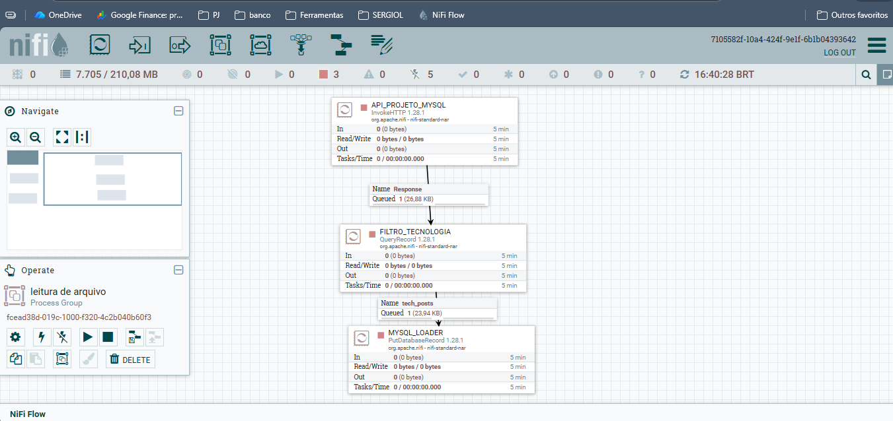

code
Markdown
# 🤖 AI-Driven ETL Pipeline Automation (NiFi + Ollama + MySQL)

## 📊 Fluxo de Dados Gerado



Este projeto demonstra a criação de um **Agente de Engenharia de Dados Autônomo** capaz de projetar, configurar e executar pipelines de ETL (Extract, Transform, Load) no Apache NiFi, utilizando Inteligência Artificial local (LLMs) para a tomada de decisões técnicas.

## 🌟 Destaques do Projeto
- **Cérebro de IA Local:** Integração com **Ollama (Llama 3.2)** para gerar lógica de negócio (SQL) e nomes de componentes sem custo de API externa.
- **Automação de Infraestrutura:** Uso do **NiPyApi** (Python) para controlar a API REST do NiFi, eliminando a configuração manual por interface gráfica.
- **Pipeline End-to-End:** Fluxo completo que extrai dados de APIs REST, filtra conteúdos dinamicamente via IA e persiste em banco de dados **MySQL**.
- **Segurança de Dados:** Implementação de variáveis de ambiente (`.env`) para proteção de credenciais sensíveis.

## 🏗️ Arquitetura do Sistema
1. **Usuário:** Envia uma ordem em linguagem natural (ex: "Crie um processo para ler notícias de tecnologia").
2. **Agente Python:** Atua como o "sistema nervoso", enviando prompts para a IA e comandos para o NiFi.
3. **Ollama (LLM):** Decide o nome do processo, a URL da API e escreve o comando SQL de filtragem.
4. **Apache NiFi:** Executa a carga pesada de dados, gerenciando filas e conexões.
5. **MySQL:** Armazena os dados finais estruturados.

## 🛠️ Tecnologias Utilizadas
- **Linguagem:** Python 3.10
- **IA:** Ollama (Llama 3.2 / Phi-3)
- **Orquestração:** Apache NiFi 1.28
- **SDK NiFi:** NiPyApi
- **Framework IA:** LangChain / LiteLLM
- **Banco de Dados:** MySQL 8.0

## 📋 Pré-requisitos
- Java JRE/JDK 11 ou 17 instalado.
- Apache NiFi instalado e rodando localmente.
- Ollama instalado com os modelos `llama3.2` ou `phi3`.
- Driver JDBC do MySQL (`mysql-connector-j`) para o NiFi.

## 🚀 Como Executar

### 1. Clonar o repositório
```bash
git clone https://github.com/seu-usuario/agente-ia-etl-nifi.git
cd agente-ia-etl-nifi
2. Configurar o Ambiente Virtual
code
Powershell
python -m venv venv
.\venv\Scripts\Activate.ps1
pip install -r requirements.txt
3. Configurar Credenciais
Crie um arquivo .env na raiz do projeto:
code
Text
NIFI_USER=seu_usuario_nifi
NIFI_PASS=sua_senha_nifi
MYSQL_PASS=sua_senha_mysql
4. Iniciar Serviços
Inicie o MySQL.
Inicie o Ollama: ollama run llama3.2.
Inicie o Apache NiFi: bin/run-nifi.bat.
5. Rodar o Agente
code
Powershell
python src/agente_nifi_mysql.py
📊 Resultados Esperados
O script irá interagir com o NiFi e criar automaticamente:
Um processador InvokeHTTP configurado com uma API sugerida pela IA.
Um processador QueryRecord contendo um SQL de filtragem gerado pela IA.
Um processador PutDatabaseRecord pronto para inserir dados no MySQL.
Todas as conexões (setas) entre os componentes devidamente estabelecidas.
📄 Licença
Distribuído sob a licença MIT. Veja LICENSE para mais informações.
Desenvolvido por [Sergio de Lima]
Engenheiro de Dados focado em Automação e IA.