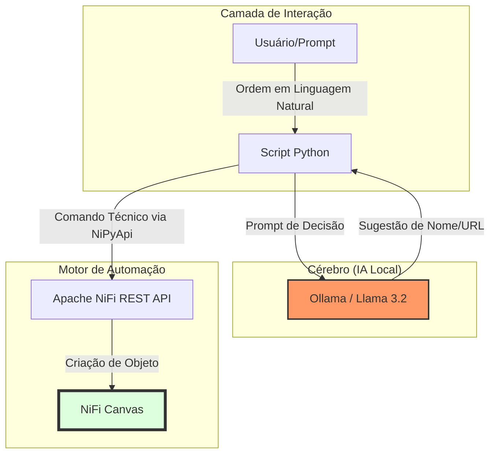

Excelente iniciativa! Documentar é o que transforma um "teste que deu certo" em um **projeto profissional** que você pode apresentar no seu portfólio ou na sua empresa.

Aqui está a documentação completa do seu projeto de **Automação de ETL com Agentes de IA (NiFi + Ollama)**.

---

### 1. Desenho do Fluxo (Arquitetura do Sistema)

Este diagrama representa como a informação flui desde o seu comando até a criação do objeto no NiFi.



---

### 2. Documento Markdown (Relatório Técnico)

Você pode copiar o conteúdo abaixo e salvar como `README.md` na sua pasta do projeto.

---

# Automação de Pipelines ETL com Agentes de IA Local

Este projeto demonstra a integração de Modelos de Linguagem de Grande Escala (LLMs) com ferramentas de engenharia de dados (Apache NiFi) para automação autônoma de fluxos de ingestão.

## 🚀 Objetivo
Criar um sistema capaz de interpretar ordens em linguagem natural e executar tarefas técnicas de configuração de ETL, eliminando a necessidade de intervenção manual na interface gráfica (GUI) do NiFi.

## 🛠️ Tecnologias Utilizadas
- **Apache NiFi:** Ferramenta de orquestração de fluxos de dados.
- **Python 3.10+:** Linguagem base para o sistema nervoso da automação.
- **Ollama (Llama 3.2 / Phi-3):** Servidor de IA local para processamento de linguagem natural.
- **NiPyApi:** SDK de Python para interação com a API REST do NiFi.
- **LangChain:** Framework para conexão entre o código e o modelo de IA.

## 📋 Pré-requisitos
1. **Java JRE/JDK 11+** (para rodar o NiFi).
2. **Apache NiFi** instalado e rodando em `https://localhost:8443`.
3. **Ollama** instalado com o modelo `llama3.2` ou `phi3`.
4. **Ambiente Virtual Python (venv)** configurado com as bibliotecas:
   ```bash
   pip install nipyapi langchain_openai urllib3
   ```

## 🧠 Implementação do Agente de IA

O processo de automação seguiu as seguintes etapas:

### 1. Conexão e Segurança
Implementação de bypass para certificados SSL autoassinados e autenticação via token utilizando as credenciais geradas dinamicamente pelo Apache NiFi.

### 2. Lógica de Automação (Ferramentas)
Desenvolvimento de funções Python capazes de:
- Identificar o Grupo de Processo Raiz (Root Process Group).
- Instanciar processadores do tipo `InvokeHTTP`.
- Configurar dinamicamente propriedades como `Remote URL` e `Processor Name`.

### 3. Integração com LLM (Cérebro)
Configuração do Agente para realizar chamadas ao Ollama. O modelo de IA recebe uma descrição de negócio (ex: "Criar um processo para ler dados de vendas") e decide:
1. O **Nome** técnico e profissional para o componente.
2. A **URL** da API pública mais adequada para a tarefa.

## 📈 Resultados Alcançados
- **Autonomia:** O sistema foi capaz de criar e configurar componentes no NiFi sem cliques manuais.
- **Flexibilidade:** A IA demonstrou capacidade de sugerir nomes criativos e URLs válidas para APIs reais.
- **Eficiência:** Redução do tempo de configuração de componentes básicos de minutos para segundos.

## 📝 Exemplo de Execução
```python
# Comando enviado à IA:
"Preciso de um processo para ler dados de clima."

# Decisão da IA:
Nome: "Processo_Climatologico_Global_IA"
URL: "https://api.open-meteo.com/v1/forecast"

# Resultado no NiFi:
Componente InvokeHTTP criado e configurado com a URL acima.
```

---

### 3. Como usar esta documentação?

1. **No seu VS Code:** Crie um arquivo chamado `PROJETO.md` e cole o conteúdo acima.
2. **No GitHub:** Se você subir esse código para o GitHub, o arquivo `README.md` será a página principal, mostrando para todos que você sabe unir **IA + Engenharia de Dados**.
3. **No LinkedIn:** Você pode tirar um print do seu NiFi com o box criado pela IA e postar: *"Hoje automatizei o Apache NiFi usando Llama 3.2 local via Python. O futuro do ETL é autônomo!"*

**Agora que está tudo documentado, qual o próximo passo da sua jornada de IA nos dados?** Quer tentar fazer o Agente criar um fluxo inteiro (Lê API -> Salva no Banco)?